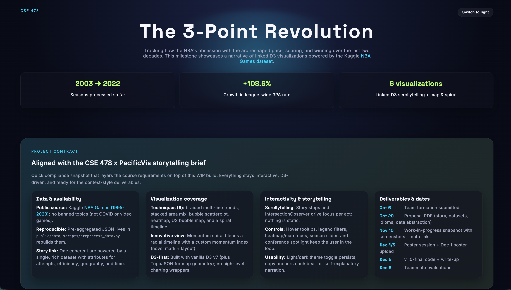
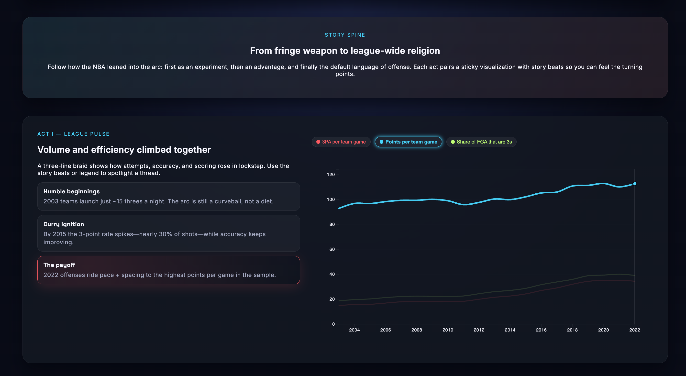
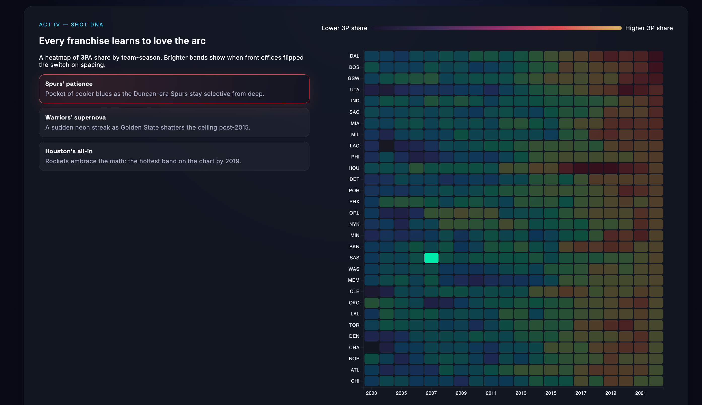
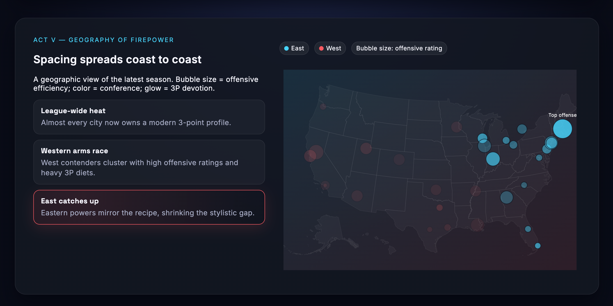
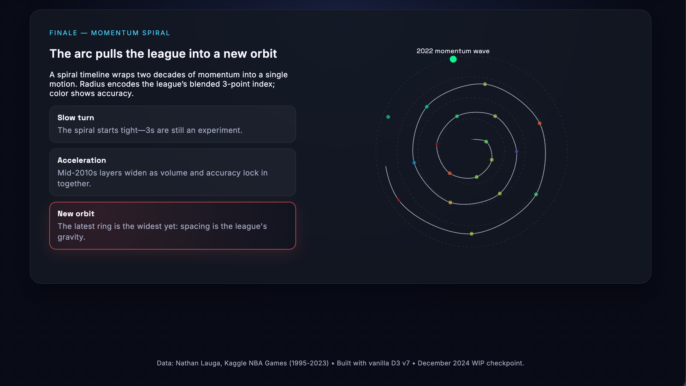

🚀 Project Title & Tagline
=========================
**The 3-Point Revolution Dashboard** 🏀
> "Unlocking insights from the world of three-point shooting"

📖 Description
==============

The 3-Point Revolution Dashboard is a comprehensive data visualization platform designed to provide in-depth analysis and insights into the world of three-point shooting in basketball. The project aims to help coaches, players, and fans better understand the trends and patterns in three-point shooting, enabling data-driven decision-making and strategy development. By leveraging advanced data processing and visualization techniques, this dashboard offers a unique perspective on the game, allowing users to explore and interact with the data in a engaging and intuitive way.

The project consists of a Python-based data preprocessing pipeline, a web-based dashboard built using HTML, CSS, and JavaScript, and a robust API for data retrieval and manipulation. The dashboard features a range of interactive visualizations, including maps, charts, and tables, which provide a detailed overview of three-point shooting performance at various levels, from individual players to teams and leagues. By examining the data through different lenses, users can gain a deeper understanding of the factors that influence three-point shooting success and develop strategies to improve performance.

The 3-Point Revolution Dashboard is a work-in-progress project, and this README provides an overview of the current state of the project, including its features, technical stack, and usage instructions. We invite contributors to join the project and help shape its future development.

📖 Additional Description
-------------------------

The dashboard is built on top of a robust data pipeline that processes and transforms raw data from various sources, including CSV files, JSON datasets, and external APIs. The data is then stored in a structured format, allowing for efficient querying and retrieval. The dashboard's frontend is built using modern web technologies, including HTML, CSS, and JavaScript, and features a responsive design that adapts to different screen sizes and devices. The project also includes a set of automated tests and validation scripts to ensure data accuracy and consistency.

✨ Features
==========

Here are some of the key features of the 3-Point Revolution Dashboard:

* **Data Preprocessing**: A Python-based pipeline for processing and transforming raw data from various sources
* **Interactive Visualizations**: A range of interactive charts, maps, and tables for exploring and analyzing three-point shooting data
* **Player and Team Profiles**: Detailed profiles for individual players and teams, including performance metrics and statistics
* **League and Season Comparisons**: Comparisons of three-point shooting performance across different leagues and seasons
* **Data Filtering and Sorting**: Advanced filtering and sorting options for customizing the data view
* **API for Data Retrieval**: A robust API for retrieving and manipulating data, enabling integration with external applications and services
* **Automated Testing and Validation**: Automated tests and validation scripts for ensuring data accuracy and consistency
* **Responsive Design**: A responsive design that adapts to different screen sizes and devices

🧰 Tech Stack Table
==================

| Component | Technology |
| --- | --- |
| Frontend | HTML, CSS, JavaScript (D3.js, TopoJSON) |
| Backend | Python (data preprocessing and API) |
| Tools | CSV, JSON, Pandas, NumPy, D3.js, TopoJSON |
| Database | Structured data storage ( CSV, JSON) |

📁 Project Structure
=====================

The project is organized into the following folders and files:

* `data/`: Raw and processed data files (CSV, JSON)
* `src/`: Source code for the data preprocessing pipeline and API (Python)
* `web/`: Web-based dashboard code (HTML, CSS, JavaScript)
* `tests/`: Automated tests and validation scripts (Python)
* `README.md`: This README file
* `preprocess_data.py`: Python script for data preprocessing
* `index.html`: HTML file for the dashboard
* `styles.css`: CSS file for styling the dashboard
* `app.js`: JavaScript file for the dashboard's interactive visualizations

⚙️ How to Run
==============

To run the project, follow these steps:

1. **Setup**: Clone the repository and navigate to the project folder
2. **Environment**: Install the required dependencies, including Python, Pandas, NumPy, and D3.js
3. **Build**: Run the data preprocessing pipeline using `python preprocess_data.py`
4. **Deploy**: Open the `index.html` file in a web browser to view the dashboard

**Setup Instructions**

To set up the project, run the following commands:
```bash
git clone https://github.com/username/repository.git
cd repository
pip install -r requirements.txt
```
**Environment Variables**

The project requires the following environment variables to be set:
```bash
export DATA_DIR=/path/to/data
export API_KEY=your_api_key
```
**Build and Deploy**

To build and deploy the project, run the following commands:
```bash
python preprocess_data.py
open index.html
```
🧪 Testing Instructions
======================

To run the automated tests and validation scripts, follow these steps:

1. **Navigate to the tests folder**: `cd tests`
2. **Run the tests**: `python test_data.py`
3. **Run the validation scripts**: `python validate_data.py`

**Test Coverage**

The project aims to achieve 100% test coverage for all components, including the data preprocessing pipeline, API, and dashboard.

📸 Screenshots
==============

Here are some screenshots of the dashboard:

---

<p align="center">
  
</p>

<p align="center">
  
</p>

<p align="center">
  
</p>

<p align="center">
  
</p>

<p align="center">
  
</p>


📦 API Reference
================

The project provides a robust API for retrieving and manipulating data. The API is documented using Swagger and can be accessed at `http://localhost:8000/api/docs`.

**API Endpoints**

The API provides the following endpoints:

* `GET /api/data`: Retrieves a list of available data files
* `GET /api/data/{id}`: Retrieves a specific data file by ID
* `POST /api/data`: Creates a new data file
* `PUT /api/data/{id}`: Updates an existing data file
* `DELETE /api/data/{id}`: Deletes a data file

👤 Author
=======

The 3-Point Revolution Dashboard is maintained by Ashish, Chaitanya, Nirek, Swar.